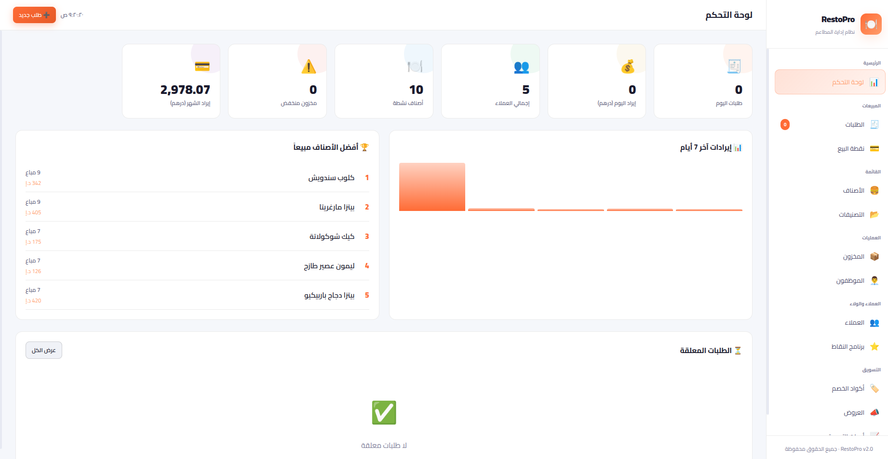

# 🍽️ RestoPro

**RestoPro** is a modern restaurant management system designed to handle all aspects of restaurant operations in one place.

---

## 🚀 Features

- 🧾 Order Management (Dine-in, Takeaway, Delivery)
- 📊 Sales & Analytics Dashboard
- 🧑‍🍳 Kitchen Display System (KDS)
- 💳 Payment Integration
- 📦 Inventory & Stock Management
- 👨‍💼 Staff & Role Management
- 🪑 Table Reservation System
- 🔔 Real-time Notifications
- 🌐 Web-based Interface

---

## 🧠 Project Vision

RestoPro aims to simplify restaurant operations by providing an all-in-one smart system that improves efficiency, reduces errors, and enhances customer experience.

---

## 🛠️ Tech Stack

- **Frontend:** HTML, CSS, JavaScript
- **Backend:** Python (Flask)
- **Database:** SQLite / PostgreSQL

---

## 📸 Screenshots




---

## ⚙️ Installation

```bash
git clone https://github.com/LaithALhaware/RestoPro.git
cd RestoPro
python web.py
```
---

## 📌 Usage
- Open the web interface
- Login as admin
- Start managing orders, tables, and inventory
  
---

## 📈 Future Improvements
- 📱 Mobile App
- 🤖 AI-powered recommendations
- 🧾 Invoice automation
- ☁️ Cloud deployment
  
---
## 🤝 Contributing

Contributions are welcome! Feel free to fork the repo and submit a pull request.

---


## 📝 License
This project is licensed under the **License**. See the [LICENSE.txt](LICENSE.txt) ⚖️ file for details.


---
## ❤️ Support This Project
If you find this project useful, consider supporting its development:

💰 Via PayPal: [[PayPal Link](https://www.paypal.com/ncp/payment/KC9EETJDVZQHG)]

Your support helps keep this project alive! 🚀🔥
